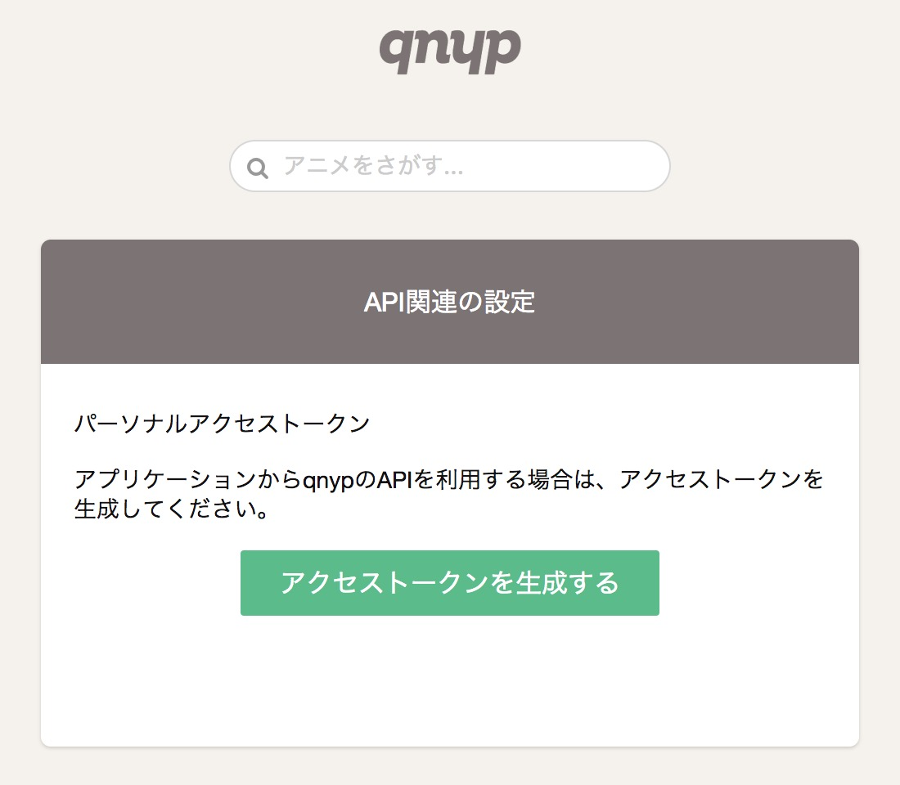

# qnyp GraphQL API Example (Ruby)

このリポジトリには、Rubyから[qnyp GraphQL API](http://developer.qnyp.com)を呼び出す以下のサンプルスクリプトが含まれています。

- `get_title.rb` - タイトルの情報を取得して結果を出力します
- `search_titles.rb` - タイトルをキーワード検索して結果を出力します

サンプルを実行するにはqnypのアクセストークンが必要です。

## アクセストークンの取得

qnypにログインした状態で [https://qnyp.com/settings/api](https://qnyp.com/settings/api) にアクセスすると、 `write` スコープを持つ自分用のアクセストークンを生成することができます。



## 準備

```console
$ ruby -v
ruby 2.4.1p111 (2017-03-22 revision 58053) [x86_64-darwin16]

$ git clone https://github.com/qnyp/qnyp-graphql-example-ruby.git
$ cd qnyp-graphql-example-ruby
$ bundle install --path .bundle
```

## get_title.rb

環境変数`ACCESS_TOKEN`にアクセストークンの値を、引数にqnypのデータベースにおけるタイトルID(数値)を指定します。

```console
$ ACCESS_TOKEN=アクセストークン bundle exec ./get_title.rb タイトルID
```

実行例:


## search_titles.rb

環境変数`ACCESS_TOKEN`にアクセストークンの値を、引数に検索キーワードを指定します。

```console
$ ACCESS_TOKEN=アクセストークン bundle exec ./search_titles.rb 検索キーワード
```

### 実行例


